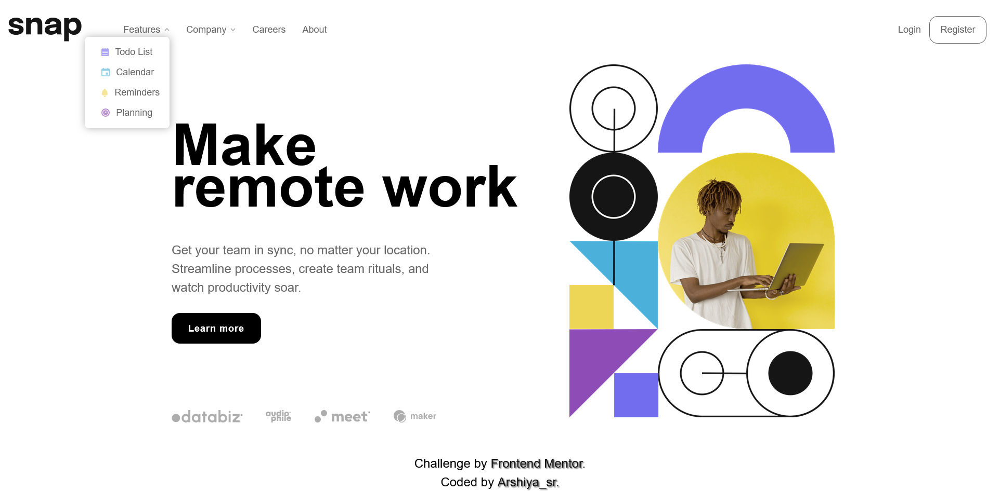
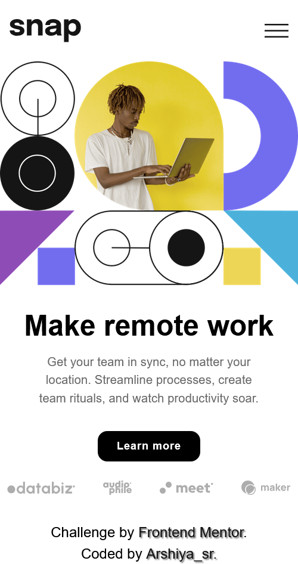
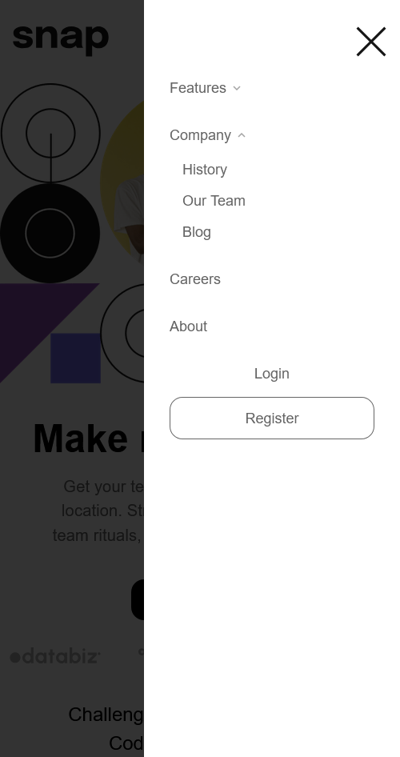

# Frontend Mentor - Intro section with dropdown navigation solution

This is a solution to the [Intro section with dropdown navigation challenge on Frontend Mentor](https://www.frontendmentor.io/challenges/intro-section-with-dropdown-navigation-ryaPetHE5). Frontend Mentor challenges help you improve your coding skills by building realistic projects. 

## Table of contents

- [Overview](#overview)
  - [The challenge](#the-challenge)
  - [Screenshot](#screenshot)
  - [Links](#links)
- [My process](#my-process)
  - [Built with](#built-with)
  - [Process](#process)
  - [What I learned](#what-i-learned)
  - [Continued development](#continued-development)
  - [Useful resources](#useful-resources)
  - [AI Collaboration](#ai-collaboration)
- [Author](#author)
- [Acknowledgments](#acknowledgments)

## Overview

### The challenge

Users should be able to:

- View the relevant dropdown menus on desktop and mobile when interacting with the navigation links
- View the optimal layout for the content depending on their device's screen size
- See hover states for all interactive elements on the page

### Screenshot

preview desktop: 
preview desktop open menu: 

preview mobile: 
preview mobile open menu: 

### Links

- Solution URL: [solution URL](https://github.com/arshiya-sr/frontend-mentor-Intro-section-with-dropdown-navigation-Project)
- Live Site URL: [live site URL](https://arshiya-sr.github.io/frontend-mentor-Intro-section-with-dropdown-navigation-Project/)

## My process

### Built with

- Semantic HTML5 markup
- CSS custom properties
- Flexbox
- Mobile-first workflow
- Media queries
- JavaScript
- Deepseek AI
- Github copilot AI

### Process

This is the first project where I want to write a brief process of how I did it in the README. 

The first thing I did for this project was to create a prototype of the HTML structure based on the desktop screenshot of the project, so I could get the HTML as close as possible to how it should be. After that, I did the class naming and filled in some attributes like alt texts. 

Then I went to the main CSS, set the colors from the style guide, and placed the other custom properties along with the project font and body styles. In the next step, I imported and linked the CSS reset file and started styling the main page for mobile. 

After that, since I don't know JavaScript well enough and I'm still learning, I built the mobile hamburger menu with the help of AI, and I roughly understood how JavaScript, CSS, and HTML connect and work together. In the next stage, I also got the JavaScript code for the dropdown menus. 

In the final step, I moved to the desktop structure and layout, built its structure and styling, and styled the dropdown menus for desktop to be beautiful and as they should be. Finally, I debugged different sections, improved the media queries, and added the necessary animations to the interactive elements. 

Although the project wasn't that large, it took me about 5 days because understanding JavaScript and the overall structure of the project was very hard and heavy for me, and since it was my first time dealing with them and I had to understand them, this project took longer than it should have.

### What I learned

What I learned from this project is roughly how JavaScript works. I'm not saying entirely, because I still can't build something like this on my own, but just roughly knowing how it works gives me a much, much better and more accurate perspective, which will help me a lot in future projects that involve JavaScript and will speed things up.

### Continued development

Although this project has a lot of room for improvement, I don't think I'll come back to it in the future to improve it, because in my opinion I did everything at a good level and there's no need for another review and optimization. However, debugging and optimizing it according to Frontend Mentor's requirements and the reviews it receives there will definitely be done.

### Useful resources

- [Deepseek AI](https://www.deepseek.com) - DeepSeek has helped me immensely on my learning journey—it's far better to use it for truly understanding concepts than for just getting answers and bypassing the work. And it helped me a lot more on this project.
- [github copilot AI](https://github.com/copilot) - GitHub Copilot has also been a huge help, especially when it comes to coding.
- [freecodecamp free online course](https://www.freecodecamp.org) - I gained my web development knowledge through freeCodeCamp, which is completely free and packed with resources: theory, labs, workshops, quizzes, and even review projects that help you master each topic. This project itself comes from freeCodeCamp, so a big thank-you to them.

### AI Collaboration

- What tools did you use (e.g., ChatGPT, Claude, GitHub Copilot)? i only used deepseek and github copilot AI a lot.
- How did you use them (e.g., debugging, generating boilerplate, brainstorming solutions)? i used it to help me understand the structure and debug small pieces of codes. also github copilot helped me nearly in all of it. It's really good.

## Author

- github - [my github](https://github.com/arshiya-sr)
- Frontend Mentor - [my frontend mentor](https://www.frontendmentor.io/profile/arshiya-sr)
- FreeCodeCamp - [my freecodecamp](https://www.freecodecamp.org/arshiya_sr)

## Acknowledgments

thank to Frontend Mentor for this awesome Project/Challenge, and thank to you for paying your time and attention to my project. I'd be so happy to receive your advice and recommendations.
Hope you a good day ♥
